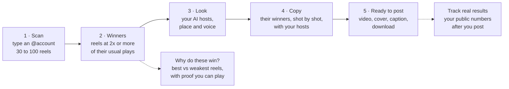
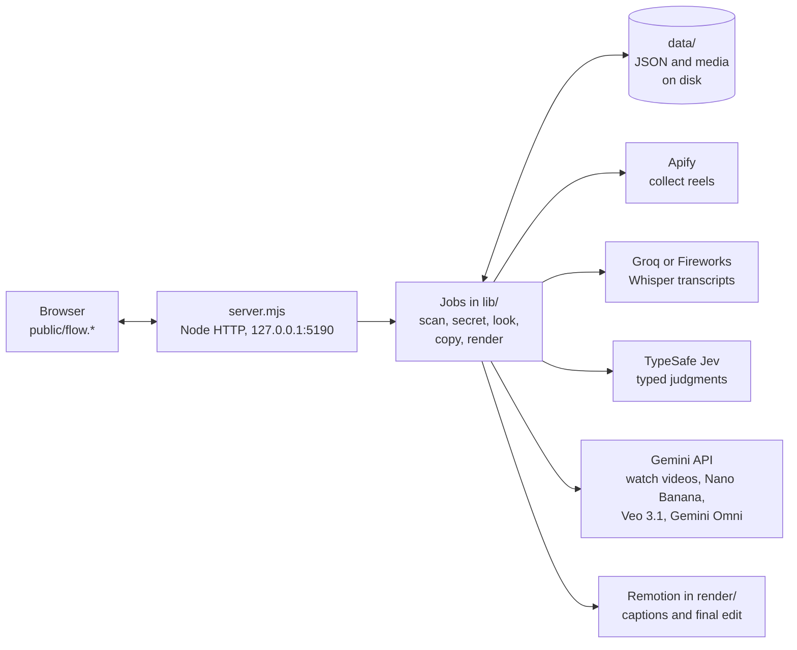

# Social Scraper

**Find the Instagram reels that win on any account, see why they win, and remake the winners with your own AI hosts.**
It runs on your own computer, shows the price before every paid step, and never posts anything for you.

[](https://github.com/kaantaskentt/social-scraper/actions/workflows/check.yml)



## The idea in one paragraph

Most accounts have a few reels that did many times better than their usual. Those are proven ideas. Social Scraper
finds them, measures them against the account's own normal (not against other accounts), explains what the winners do
differently, and then films new versions of those winners with AI hosts you design once. You review every result and
post it yourself.

## What it can do

| Step | What you get | How it works | Typical cost and time |
|---|---|---|---|
| **1 · Scan** | Up to 100 of an account's latest reels, each with plays, likes, comments, the spoken script and a score | Apify collects the reels. Each video is downloaded and its speech transcribed (Whisper on Groq or Fireworks). Jev labels each script. Each reel is scored against the account's usual plays. | About $0.65 for 100 reels, including readying the next steps (app estimate). Winners show in about 75 s; a full 100-reel scan takes about 7 min on Groq's free plan |
| **2 · Winners** | Their 6 best reels by "x their usual", plus their weakest for contrast | Code, not AI: each reel's plays divided by the median of up to 30 earlier reels from the 90 days before it. 2x or more is a winner, 5x a big winner. | Free (part of the scan) |
| **Why do these win?** (optional) | 3 things their best reels do more, 1 thing to avoid, why it works on people (with how solid the research is), and reels you can play as proof | Gemini watches about 30 reels with sound; code compares best against weakest. An optional "Winner DNA" pass tests about 25 small details and says whether they predict reels it has not seen. | About $0.35, about 3 min |
| **3 · Look** | Your brand: the format (AI host, hands only, no person or animated), the hosts, the place and the voice | Studies 3 of their best reels, then draws each picture (Nano Banana) and checks it before drawing the next. | About $0.40 to $0.70, about 2 min |
| **4 · Copy** | Their best winners, remade shot by shot with your hosts, each with a "how faithful is it" score | Picks their most-played winners that AI video can copy (skips ads for their own product, boosted posts and repeats of the same script). Films with Veo 3.1 Fast (default) or Gemini Omni. Long reels are filmed in joined parts; each part is checked before the next is paid for. The finished copy is compared with the original: shots, words and length. | Veo 3.1 Fast: $0.10 per second of video (an 8 s copy cost $0.80 and took about 2 min) |
| **4b · New reels in their style** | Fresh ideas that follow the winners' pattern, a checked script, then a finished reel | Jev scores ideas for fit, hook and how well AI video can show them; code ranks them; you pick one and see the exact price first. | Ideas cost a few cents; the video is priced before you confirm |
| **5 · Ready to post** | The finished 9:16 video with word-timed captions, a cover and a caption, ready to download | Remotion (in `render/`) edits the parts together and trims to the original's length. | Free (runs on your computer) |
| **Track real results** | Your real plays, likes, comments and shares on each posted reel | After you post, the app reads your public numbers and matches them to the reels it made. | A few cents per check |

**Reels without speech** (a song over a scene, a printed shirt, a text overlay) are copied as visual copies: the exact
text is drawn into the first frame and checked word by word, because video models garble text they write themselves.

**Other views**

- **Research view** (`/lab`): every script labelled on 8 dimensions (topic, opening move, hook, structure, evidence,
  emotional appeal, how specific the advice is, spoken call to action), with filters, engagement comparisons and the
  original reels.
- **Recording studio** (`/record`): replays a saved scan as an animation for screen recording. It makes no new paid calls.

**Built-in safety**

- Nothing is posted, sent or bought on your behalf.
- Every paid step shows its price first and has a spend ceiling.
- Paid jobs are saved before waiting, and a lost reply is never paid for twice.
- Scans pick up where they stopped after a restart.
- Every error lands in `data/errors.jsonl`, grouped, so it can be fixed at the root (`node scripts/errors.mjs open`).

## How it works (for engineers)



- **Plain Node, no root dependencies, no build step.** ES modules on Node 22.9 or newer. The only npm install is the
  video editor in `render/`.
- **Local only.** The server binds to `127.0.0.1`; state lives as JSON and media files in `data/` (written atomically).
- **AI judges, code decides.** Jev returns typed answers (choices and scores, no free text). Ranking, prices, scores and
  thresholds are plain code with unit tests. The winner formula is versioned and frozen (`public/money/1.0.mjs`, guarded
  by a golden test).
- **Fast by design.** Winners-first processing, an adaptive rate pacer, and "prep ahead": after a scan, the Look and
  Copy steps are readied in the background so the next click is instant.

| Part | Where |
|---|---|
| Server and all routes | `server.mjs` |
| Scan pipeline (collect, transcribe, label), resume after restart | `lib/pipeline.mjs`, `lib/providers.mjs` |
| Winner score ("x their usual") | `public/money/1.0.mjs` |
| Why do these win? / Winner DNA | `lib/secret-run.mjs`, `lib/secret.mjs`, `lib/dna-run.mjs` |
| The Look | `lib/kit.mjs`, `lib/kit-run.mjs` |
| Copy studio (picker, batches, faithfulness check) | `lib/copy.mjs`, `lib/copy-run.mjs` |
| Video makers (Veo, Omni, joined parts, checks) | `lib/reel-make.mjs`, `lib/kit-reel.mjs`, `lib/veo.mjs`, `lib/gemini-jobs.mjs` |
| New reels from ideas | `lib/reel-plan.mjs`, `lib/reel-plan-run.mjs` |
| Final edit (captions, cover) | `render/`, `lib/render-reel.mjs` |
| Real results after posting | `lib/results.mjs` |
| Prep ahead | `lib/prep.mjs` |
| Error log | `lib/errors.mjs`, `scripts/errors.mjs` |
| Screens | `public/flow.html`, `flow.js`, `flow-views.mjs`, `copy-view.mjs`, `flow.css` |
| Paid quality exams for the checkers | `scripts/qa-eval.mjs`, `scripts/fidelity-eval.mjs`, `scripts/checker-eval.mjs`, `evals/` |

## Run it

You need [Node.js](https://nodejs.org) 22.9 or newer (24 recommended) and FFmpeg. It is built and tested on macOS.

```sh
brew install node ffmpeg            # macOS with Homebrew
git clone https://github.com/kaantaskentt/social-scraper.git
cd social-scraper
(cd render && npm ci)               # the video editor
npm run setup                       # creates .env from .env.example
```

Put your keys in `.env` (it is gitignored):

| Key | Used for | Needed for |
|---|---|---|
| `APIFY_TOKEN` | Collecting reels | Scan |
| `GROQ_API_KEY` (or `FIREWORKS_API_KEY`) | Transcripts and caption timing | Scan, final edit |
| `TYPESAFE_API_KEY` | Jev judgments | Scan, picking, checks |
| `GEMINI_API_KEY` | Watching videos, pictures, Veo and Omni video | Why do these win?, Look, Copy |
| `ANTHROPIC_API_KEY` | A second opinion on finished reels | Optional |

```sh
npm run doctor                      # checks tools and keys without printing them
npm start                           # then open http://127.0.0.1:5190
```

Click **New analysis**, type an account and pick 30, 60 or 100 reels. The step-by-step guide, including where to get
each key, is in [docs/SETUP.md](docs/SETUP.md).

## Tests

```sh
npm test        # about 500 tests in about 5 seconds; every provider is faked, nothing is paid
npm run check   # syntax check of every file
```

The same checks run on GitHub for every push. Logic has unit tests; the server tests start the real server against fake
providers. Real-money checks (how well the checkers judge, how faithful copies are) live in `scripts/*-eval.mjs` and are
run by hand because they cost cents.

## Where it stands (October 2026)

**Verified with real runs**

- Scanning a new account end to end, with winners on screen in about 75 s.
- The picker choosing an account's real viral reels (millions of plays), not small ones.
- A Look end to end, and an 8 s Veo copy end to end.
- Exact on-screen text in visual copies.

**Not proven yet**

- **Copy faithfulness is just under the bar.** A copy counts as faithful at 75/100; the best visual copy so far scores
  70.
- **Long copies** (Veo chains past 8 s, Omni past 40 s) pass tests with fake providers but have not been filmed for real.
- **No posted results yet.** Until real reels are posted and measured, every quality score is a stand-in.
- **The "will this win?" judges are weak.** Judging one reel alone was a coin flip; comparing two reels picks the better
  one 58 to 75% of the time.

Details and next priorities: [HANDOFF.md](HANDOFF.md).

## Privacy

The app runs on `127.0.0.1` and has no login, so it should not be put on a public server. Keys stay in `.env`. Each
provider only gets what its step needs: Apify gets the account name, the transcriber gets audio, Jev gets transcript
text, Gemini gets the videos and pictures it watches or makes, and Claude (only if you add its key) sees one frame per second and the transcript of a finished reel. `data/` (scans, videos, made reels) is private and never
committed. Full data flow: [docs/PRIVACY.md](docs/PRIVACY.md).

## License

MIT, see [LICENSE](LICENSE). Social Scraper is an independent project, not an official product of Instagram, Apify,
Groq, Fireworks, TypeSafe, Google or Anthropic.
