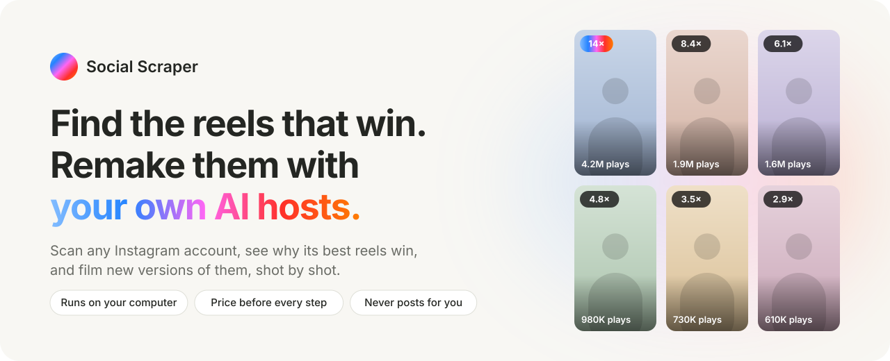
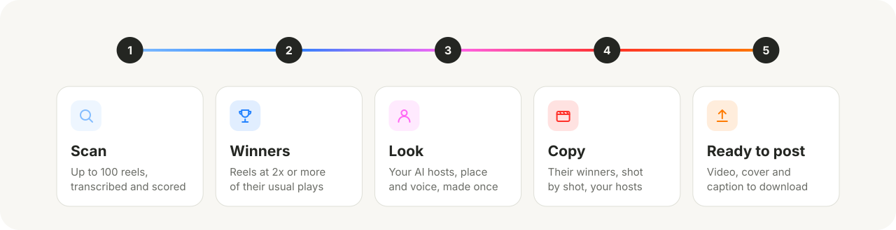
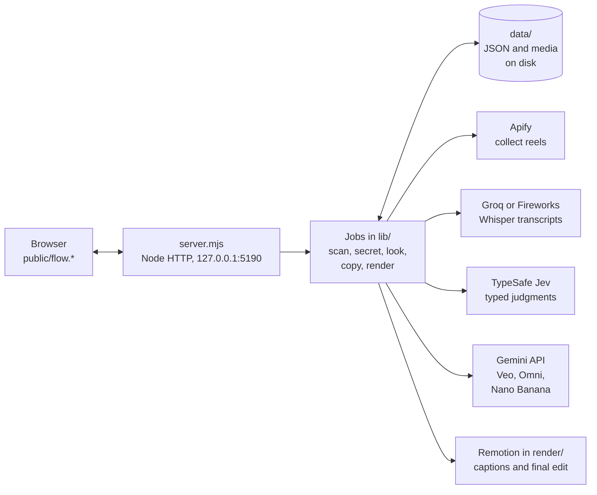

<p align="center">
  <picture>
    <source media="(prefers-color-scheme: dark)" srcset="docs/assets/banner-dark.svg">
    
  </picture>
</p>

<p align="center">
  <a href="https://github.com/kaantaskentt/social-scraper/actions/workflows/check.yml"></a>
  
  
  <a href="LICENSE"></a>
</p>

<p align="center">
  <a href="#what-it-can-do"><b>What it can do</b></a> &nbsp;·&nbsp;
  <a href="#run-it"><b>Run it</b></a> &nbsp;·&nbsp;
  <a href="#how-it-works"><b>How it works</b></a> &nbsp;·&nbsp;
  <a href="#where-it-stands"><b>Where it stands</b></a>
</p>

<br>

Most accounts have a few reels that did many times better than their usual. Those are proven ideas.
**Social Scraper finds them, shows why they won, and films new versions with AI hosts you design once.**
It runs on your own computer, shows the price before every paid step, and never posts anything for you.

<picture>
  <source media="(prefers-color-scheme: dark)" srcset="docs/assets/steps-dark.svg">
  
</picture>

## What it can do

| Step | What you get | Cost and time |
|:--|:--|:--|
| **1 · Scan** | Up to 100 of an account's latest reels, each transcribed and scored against the account's own usual plays | About $0.65 for 100 reels.<br>Winners in about 75 s |
| **2 · Winners** | Their 6 best reels by "× their usual", plus their weakest for contrast | Included |
| **3 · Look** | Your brand: the format (AI host, hands only, no person or animated), the hosts, the place and the voice | About $0.40 to $0.70.<br>About 2 min |
| **4 · Copy** | Their best winners, remade shot by shot with your hosts, each with a "how faithful is it" score | Veo 3.1 Fast: $0.10 a second.<br>An 8 s copy: about 2 min |
| **5 · Ready to post** | The 9:16 video with word-timed captions, a cover and a caption, ready to download | Free, on your computer |

**Also included**

- **Why do these win?** 3 things their best reels do more, 1 thing to avoid, why it works on people (with how solid the
  research is), and reels you can play as proof. About $0.35, about 3 minutes.
- **New reels in their style.** Ideas that follow the winners' pattern, a checked script, then a finished reel.
- **Visual copies.** Reels without speech (a song over a scene, a printed shirt, a text overlay) are copied with the exact
  text drawn into the first frame and checked word by word, because video models garble text they write themselves.
- **Track real results.** After you post, the app reads your public plays, likes, comments and shares for each reel.
- **Research view** at `/lab`: every script labelled on 8 dimensions (topic, opening, hook, structure, evidence, emotion,
  advice, call to action), with filters and engagement comparisons. **Recording studio** at `/record`: replays a scan
  as an animation for screen recording.

<details>
<summary><b>How each step works</b></summary>

<br>

- **Scan.** Apify collects the reels. Each video is downloaded and its speech transcribed (Whisper on Groq or Fireworks).
  Jev labels each script from the words alone, before any numbers are joined.
- **Winners.** Plain code, not AI: each reel's plays divided by the median of up to 30 earlier reels from the 90 days
  before it. 2× or more is a winner, 5× a big winner.
- **Why do these win?** Gemini watches about 30 reels with sound; code compares the best with the weakest. An optional
  "Winner DNA" pass tests about 25 small details and says whether they predict reels it has not seen.
- **Look.** Studies 3 of their best reels, then draws each picture (Nano Banana) and checks it before drawing the next.
- **Copy.** Picks their most-played winners that AI video can copy, skipping ads for their own product, boosted posts and
  repeats of the same script. Films with Veo 3.1 Fast (default) or Gemini Omni. Long reels are filmed in joined parts,
  and each part is checked before the next one is paid for. The finished copy is compared with the original: shots,
  words and length.
- **New reels in their style.** Jev scores ideas for fit, hook and how well AI video can show them; code ranks them; you
  pick one and see the exact price first.
- **Ready to post.** Remotion (in `render/`) joins the parts, adds the captions and trims to the original's length.

</details>

**Built-in safety:** nothing is posted, sent or bought for you · every paid step shows its price first and has a spend
ceiling · paid jobs are saved before waiting, so a lost reply is never paid for twice · scans pick up where they stopped
after a restart · every error lands in `data/errors.jsonl`, grouped, so it gets fixed at the root.

## Run it

You need [Node.js](https://nodejs.org) 22.9 or newer (24 recommended) and FFmpeg. It is built and tested on macOS.

```sh
brew install node ffmpeg
git clone https://github.com/kaantaskentt/social-scraper.git
cd social-scraper
(cd render && npm ci)     # the video editor
npm run setup             # creates .env from .env.example
```

Add your keys to `.env` (it is gitignored):

| Key | Used for | Needed for |
|:--|:--|:--|
| `APIFY_TOKEN` | Collecting reels | Scan |
| `GROQ_API_KEY` or `FIREWORKS_API_KEY` | Transcripts and caption timing | Scan, final edit |
| `TYPESAFE_API_KEY` | Jev judgments | Scan, picking, checks |
| `GEMINI_API_KEY` | Watching videos, pictures, Veo and Omni video | Why do these win?, Look, Copy |
| `ANTHROPIC_API_KEY` | A second opinion on finished reels | Optional |

```sh
npm run doctor            # checks tools and keys without printing them
npm start                 # then open http://127.0.0.1:5190
```

Click **New analysis**, type an account and pick 30, 60 or 100 reels. The full guide, with where to get each key, is
in [docs/SETUP.md](docs/SETUP.md).

## How it works

For engineers: a small local web app. The browser talks to one Node server; long jobs run in `lib/` and save their
state to disk.



- **Plain Node, no root dependencies, no build step.** ES modules on Node 22.9 or newer. The only npm install is the
  video editor in `render/`.
- **Local only.** The server binds to `127.0.0.1`; state lives as JSON and media files in `data/`, written atomically.
- **AI judges, code decides.** Jev returns typed answers (choices and scores, no free text). Ranking, prices, scores and
  thresholds are plain code with unit tests. The winner formula is versioned and frozen (`public/money/1.0.mjs`,
  guarded by a golden test).
- **Fast by design.** Winners first, an adaptive rate pacer, and "prep ahead": after a scan, the Look and Copy steps
  are readied in the background so the next click is instant.

<details>
<summary><b>Where things are in the code</b></summary>

<br>

| Part | Where |
|:--|:--|
| Server and all routes | `server.mjs` |
| Scan pipeline (collect, transcribe, label), resume after restart | `lib/pipeline.mjs`, `lib/providers.mjs` |
| Winner score ("× their usual") | `public/money/1.0.mjs` |
| Why do these win? and Winner DNA | `lib/secret-run.mjs`, `lib/secret.mjs`, `lib/dna-run.mjs` |
| The Look | `lib/kit.mjs`, `lib/kit-run.mjs` |
| Copy studio (picker, batches, faithfulness check) | `lib/copy.mjs`, `lib/copy-run.mjs` |
| Video makers (Veo, Omni, joined parts, checks) | `lib/reel-make.mjs`, `lib/kit-reel.mjs`, `lib/veo.mjs`, `lib/gemini-jobs.mjs` |
| New reels from ideas | `lib/reel-plan.mjs`, `lib/reel-plan-run.mjs` |
| Final edit (captions, cover) | `render/`, `lib/render-reel.mjs` |
| Real results after posting | `lib/results.mjs` |
| Prep ahead | `lib/prep.mjs` |
| Error log | `lib/errors.mjs`, `scripts/errors.mjs` |
| Screens | `public/flow.html`, `flow.js`, `flow-views.mjs`, `copy-view.mjs`, `flow.css` |
| Paid quality exams for the checkers | `scripts/qa-eval.mjs`, `scripts/fidelity-eval.mjs`, `scripts/checker-eval.mjs`, `evals/` |
| The README pictures | `docs/readme-art.mjs` |

</details>

**Tests.** `npm test` runs about 500 tests in about 5 seconds with every provider faked, so nothing is paid.
`npm run check` checks the syntax of every file. Both run on GitHub for every push. Real-money checks (how well the
checkers judge, how faithful copies are) live in `scripts/*-eval.mjs` and are run by hand because they cost cents.

## Where it stands

Last updated 1 October 2026. Details and next priorities are in [HANDOFF.md](HANDOFF.md).

| Verified with real runs | Not proven yet |
|:--|:--|
| Scanning a new account end to end, winners on screen in about 75 s | **Copy faithfulness is just under the bar:** a copy counts as faithful at 75/100, the best visual copy so far scores 70 |
| The picker choosing an account's real viral reels (millions of plays), not small ones | **Long copies** (Veo past 8 s, Omni past 40 s) pass tests with fake providers but have not been filmed for real |
| A Look end to end, and an 8 s Veo copy end to end | **No posted results yet.** Until real reels are posted and measured, every quality score is a stand-in |
| Exact on-screen text in visual copies | **The "will this win?" judges are weak:** one reel alone was a coin flip; comparing two picks the better one 58 to 75% of the time |

## Privacy

The app runs on `127.0.0.1` and has no login, so it should not be put on a public server. Keys stay in `.env`. Each
provider only gets what its step needs: Apify gets the account name, the transcriber gets audio, Jev gets transcript
text, Gemini gets the videos and pictures it watches or makes, and Claude (only if you add its key) sees one frame per
second and the transcript of a finished reel. `data/` (scans, videos, made reels) is private and never committed.
Full data flow: [docs/PRIVACY.md](docs/PRIVACY.md).

## License

MIT, see [LICENSE](LICENSE). Social Scraper is an independent project, not an official product of Instagram, Apify,
Groq, Fireworks, TypeSafe, Google or Anthropic.
